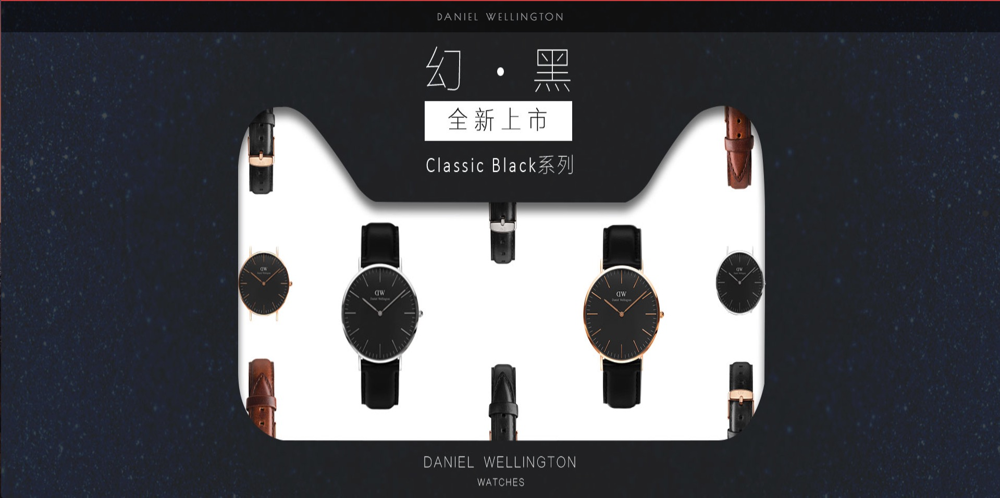
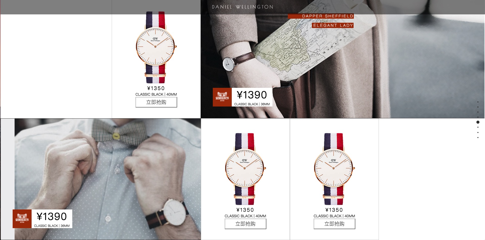

up-down
============
##### 运用fullpage插件，实现上下页面切换


```
<script type="text/javascript">
        $(document).ready(function () {
            $('#fullpage').fullpage({
                continuousVertical: true,
                anchors: ['page1', 'page2', 'page3', 'page4', 'page5', 'page6', 'page7', 'page8'],
                navigation: true,
                navigationPostion: 'right',
                navigationTooltips: [' ', ' ', ' ', ' ', ' ', ' ', ' ', ' '],

            });
        })
    </script>
```
## 配置

### 1、选项
============


| verticalCentered | 字符串 | true | 内容是否垂直居中 |
|---|---|---|---|
| resize | 布尔值 | false | 字体是否随着窗口缩放而缩放 |
| slidesColor | 函数 | 无 | 设置背景颜色 |
| anchors | 数组 | 无 | 定义锚链接 |
| scrollingSpeed | 整数 | 700 | 滚动速度，单位为毫秒 |
| easing | 字符串 | easeInQuart | 滚动动画方式 |
| menu | 布尔值 | false | 绑定菜单，设定的相关属性与 anchors 的值对应后，菜单可以控制滚动 |
| navigation | 布尔值 | false | 是否显示项目导航 |
| navigationPosition | 字符串 | right | 项目导航的位置，可选 left 或 right |
| navigationColor | 字符串 | #000 | 项目导航的颜色 |
| navigationTooltips | 数组 | 空 | 项目导航的 tip |
| slidesNavigation | 布尔值 | false | 是否显示左右滑块的项目导航 |
| slidesNavPosition | 字符串 | bottom | 左右滑块的项目导航的位置，可选 top 或 bottom |
| controlArrowColor | 字符串 | #fff | 左右滑块的箭头的背景颜色 |
| loopBottom | 布尔值 | false | 滚动到最底部后是否滚回顶部 |
| loopTop | 布尔值 | false | 滚动到最顶部后是否滚底部 |
| loopHorizontal | 布尔值 | true | 左右滑块是否循环滑动 |
| autoScrolling | 布尔值 | true | 是否使用插件的滚动方式，如果选择 false，则会出现浏览器自带的滚动条 |
| scrollOverflow | 布尔值 | false | 内容超过满屏后是否显示滚动条 |
| css3 | 布尔值 | false | 是否使用 CSS3 transforms 滚动 |
| paddingTop | 字符串 | 0 | 与顶部的距离 |
| paddingBottom | 字符串 | 0 | 与底部距离 |
| fixedElements | 字符串 | 无 |  |
| normalScrollElements |  | 无 |  |
| keyboardScrolling | 布尔值 | true | 是否使用键盘方向键导航 |
| touchSensitivity | 整数 | 5 |  |
| continuousVertical | 布尔值 | false | 是否循环滚动，与 loopTop 及 loopBottom 不兼容 |
| animateAnchor | 布尔值 | true |  |
| normalScrollElementTouchThreshold | 整数 | 5 |


### 2、方法
===========


| moveSectionUp() | 向上滚动 |
|---|---|
| moveSectionDown() | 向下滚动 |
| moveTo(section, slide) | 滚动到 |
| moveSlideRight() | slide 向右滚动 |
| moveSlideLeft() | slide 向左滚动 |
| setAutoScrolling() | 设置页面滚动方式，设置为 true 时自动滚动 |
| setAllowScrolling() | 添加或删除鼠标滚轮/触控板控制 |
| setKeyboardScrolling() | 添加或删除键盘方向键控制 |
| setScrollingSpeed() | 定义以毫秒为单位的滚动速度 |


### 3、图片展示
===========






